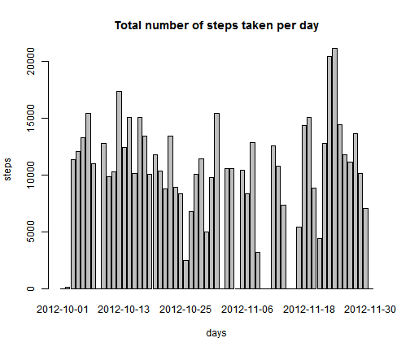
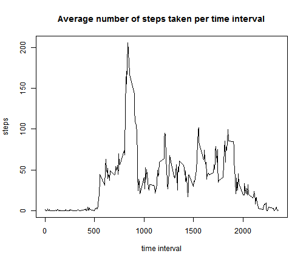
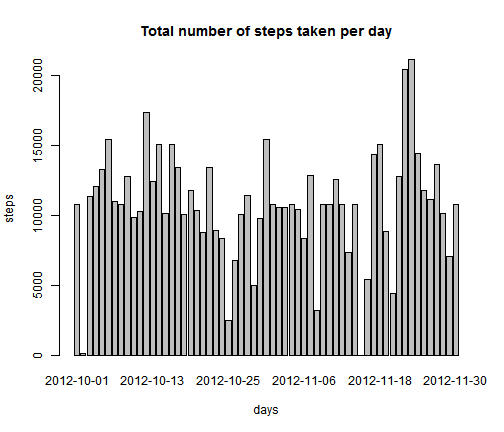
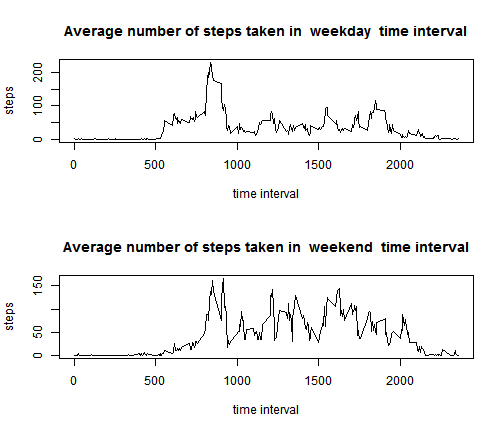

## Loading and preprocessing the data


```r

activity <- read.csv("activity.csv")
```


## What is mean total number of steps taken per day?


```r
step_by_day <- by(activity$steps, activity$date, sum, na.rm = T)
barplot(step_by_day, ylab = "steps", xlab = "days", main = "Total number of steps taken per day")
```

 

**median** and **mean** total number of steps taken per day


```r

summary(activity$steps, activity$date, na.rm = T)[3:4]
```

```
## Median   Mean 
##    0.0   37.4
```


## What is the average daily activity pattern?

```r

activity$interval <- sprintf("%04d", activity$interval)
int_mean <- tapply(activity$steps, activity$interval, mean, na.rm = T)
names(int_mean) <- unique(activity$interval)
plot(unique(activity$interval), int_mean, type = "l", ylab = "steps", xlab = "time interval", 
    main = "Average number of steps taken per time interval")
```

 


interval with **max** numm of steps

```r

int_mean[which(int_mean %in% max(int_mean))]
```

```
##  0835 
## 206.2
```


## Imputing missing values

total number of **missing values** in the dataset

```r

sum(is.na(activity$steps))
```

```
## [1] 2304
```


histogram of the total number of steps taken each day where **NA** have been filled with the mean for 
5-minute interval


```r
Na_index <- which(is.na(activity$steps))
activity_new <- activity
activity_new$steps[Na_index] <- int_mean[activity$interval[Na_index]]

stepNew_by_day <- by(activity_new$steps, activity_new$date, sum, na.rm = T)
barplot(stepNew_by_day, ylab = "steps", xlab = "days", main = "Total number of steps taken per day")
```

 


**median** and **mean** total number of steps taken per day for the new daraset


```r

summary(activity_new$steps, activity_new$date, na.rm = T)[3:4]
```

```
## Median   Mean 
##    0.0   37.4
```


there is no difference for the totla number of steps taken per day between **median** and **mean** of the new datasates (i.e. without NA value) and the original dataset (with NA value)

```r
summary(activity_new$steps, activity_new$date, na.rm = T)[3:4] - summary(activity$steps, 
    activity$date, na.rm = T)[3:4]
```

```
## Median   Mean 
##      0      0
```

It looks like there is not a relevant impact of imputing missing data on the estimates of the total daily number of steps
## Are there differences in activity patterns between weekdays and weekends?


```r

activity_new$date <- as.Date.factor(activity_new$date)
activity_new$weekend <- weekdays(activity_new$date, abbreviate = T)
activity_new$weekend[activity_new$weekend %in% c("lun", "mar", "mer", "gio", 
    "ven")] <- "weekday"
activity_new$weekend[activity_new$weekend %in% c("sab", "dom")] <- "weekend"
activity_new$weekend <- as.factor(activity_new$weekend)
table(activity_new$weekend)
```

```
## 
## weekday weekend 
##   12960    4608
```


```r

par(mfrow = c(2, 1))
for (wd in c("weekday", "weekend")) {
    int_mean_2 <- tapply(activity_new$steps[activity_new$weekend == wd], activity_new$interval[activity_new$weekend == 
        wd], mean, na.rm = T)
    names(int_mean_2) <- unique(activity_new$interval)
    plot(unique(activity_new$interval[activity_new$weekend == wd]), int_mean_2, 
        type = "l", ylab = "steps", xlab = "time interval", main = paste("Average number of steps taken in ", 
            wd, " time interval"))
}
```

 


